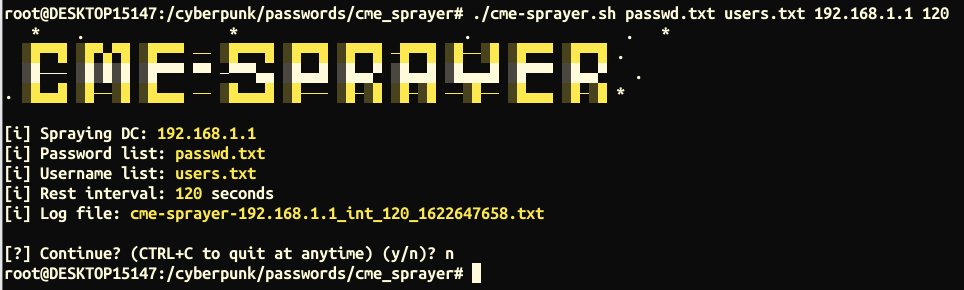

# cme_sprayer
Wrapper for recursive CrackMapExec spraying with intervals. Requires [CrackMapExec](https://github.com/byt3bl33d3r/CrackMapExec).



## USAGE
```bash
git clone https://github.com/RackunSec/cme_sprayer.git
cd cme_sprayer
chmod +x cme-sprayer.sh
./cme-sprayer.sh (passwd file) (user list) (DC IP) (interval in seconds)
```
